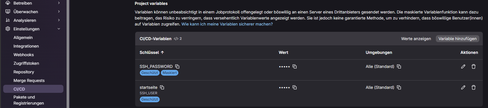
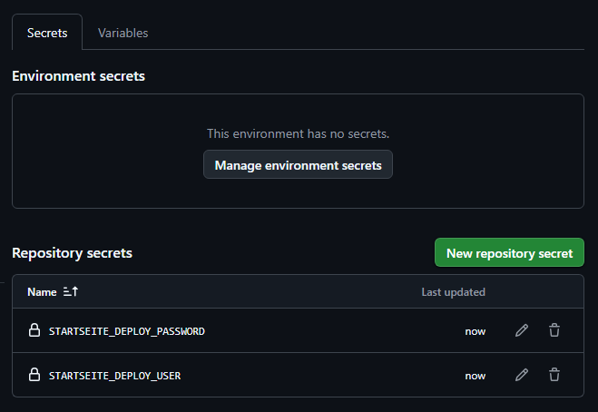

# Startseite

Eine kleine PHP-/MariaDB-Webanwendung für eine persönliche Startseite mit Links, Profilen, Gruppen und Icons.

Das Projekt dient gleichzeitig als reales Deployment-Projekt und als CI/CD-Unterrichtsbeispiel. Es ist klein genug, um die Pipeline zu verstehen, aber realistisch genug für Secrets, Docker, SSH-/FTPS-Deployment und Smoke-Tests.

## Projektüberblick

- `index.php`: eigentliche Startseite
- `login.php`: Anmeldung und Registrierung
- `impressum.php` und `datenschutz.php`: öffentliche Pflichtseiten
- `config/`: Konfiguration, Bootstrap, UI- und Aktionslogik
- `assets/uploads/icons/`: hochgeladene Icon-Dateien
- `assets/pictures/`: Bilder für die README-Dokumentation
- `docker-compose.yml`: PHP/Apache, MariaDB und phpMyAdmin
- `.gitlab-ci.yml`: GitLab-Pipeline mit SSH-Deployment
- `.github/workflows/ci.yml`: GitHub-Actions-Workflow mit FTPS-/SFTP-Demo-Deployment

## Lokaler Start

```bash
cp .env.example .env
docker compose up -d
```

Anwendung:

```text
http://localhost:28860
```

phpMyAdmin:

```text
http://localhost:28861
```

Stoppen:

```bash
docker compose down
```

## Konfiguration

`.env` enthält produktive oder lokale Werte und wird nicht committet.

Wichtige Variablen:

| Variable | Bedeutung |
|---|---|
| `MARIADB_ROOT_PASSWORD` | Root-Passwort der MariaDB |
| `MARIADB_DATABASE` | Datenbankname |
| `MARIADB_USER` | Datenbankbenutzer |
| `MARIADB_PASSWORD` | Passwort des Datenbankbenutzers |
| `SSH_USER` | SSH-Benutzer im App-Container |
| `SSH_PASSWORD` | SSH-Passwort im App-Container |
| `SSH_PUBLIC_KEY` | optionaler Public Key für SSH-Login |

Echte Geheimnisse gehören in GitLab CI/CD Variables, GitHub Secrets oder eine lokale `.env`, nicht ins Repository.

SVG-Icons werden nicht mehr aus dem Projekt in die Datenbank importiert. Beim Bootstrap entfernt die App alte SVG-Icon-Varianten aus `icon_variants`; hochgeladene Icons sind auf PNG, JPG und WebP begrenzt. Lokale private Icons können in `assets/icons/` liegen; der Ordner ist per `.gitignore` ausgeblendet und wird nicht ins Demo synchronisiert.

## GitLab CI/CD

Die produktive GitLab-Pipeline liegt in:

```text
.gitlab-ci.yml
```

Ablauf:

```text
validate -> deploy -> smoke
```

### Validate

Der Validate-Job prüft:

- PHP-Syntax aller `.php`-Dateien
- vorhandene `.env.example`
- dass keine echte `.env` im Repository liegt
- zentrale Pflichtinhalte in Impressum und Datenschutz
- einfache Secret-Leak-Regel für Datenbankwerte

### Deploy

GitLab deployt per SSH in den laufenden Docker-App-Container:

```text
startseite@192.168.112.30:28862 -> /var/www/html
```

Dafür wird im GitLab-Projekt aktuell nur diese CI/CD-Variable benötigt:

```text
SSH_PASSWORD
```

Host, Port und Benutzer stehen bewusst in der Pipeline, weil sie für dieses Unterrichts- und Heimlabor-Setup nicht geheim sind.

### Smoke

Nach dem Deployment prüft GitLab öffentlich:

```text
https://start.nik0.de/impressum.php
https://start.nik0.de/datenschutz.php
```

Der Smoke-Test beantwortet die wichtige Deployment-Frage: Ist die neue Version wirklich öffentlich angekommen?

## GitHub Actions

Die GitHub-Variante liegt in:

```text
.github/workflows/ci.yml
```

Ablauf:

```text
validate -> deploy -> smoke
```

GitHub Actions ist als Demo für klassisches Webhosting gedacht. Die YAML ist aktuell auf `ftps`, Port `21`, Zielpfad `/` und Datenbankhost `localhost` eingestellt. Wenn ein Hoster stattdessen `sftp`, einen anderen Pfad oder einen anderen Datenbankhost braucht, wird das bewusst in der Workflow-Datei geändert.

Für das GitHub-Deployment werden die Zugangsdaten getrennt nach öffentlichen Variablen und geheimen Secrets gepflegt.

Repository Variables:

| Name | Bedeutung |
|---|---|
| `STARTSEITE_DEPLOY_HOST` | Zielhost |
| `STARTSEITE_PUBLIC_URL` | öffentliche URL für den Smoke-Test |

Repository Secrets:

| Name | Bedeutung |
|---|---|
| `STARTSEITE_DEPLOY_USER` | FTP-/SFTP-Benutzer |
| `STARTSEITE_DEPLOY_PASSWORD` | FTP-/SFTP-Passwort |
| `MARIADB_DATABASE` | Datenbankname auf dem Webspace |
| `MARIADB_USER` | Datenbankbenutzer auf dem Webspace |
| `MARIADB_PASSWORD` | Passwort des Datenbankbenutzers |

Fest in `.github/workflows/ci.yml`:

| Wert | Aktuell |
|---|---|
| Deployment-Methode | `ftps` |
| Port | `21` |
| Zielpfad | `/` |
| Datenbankhost | `localhost` |

Beim GitHub-Deployment erzeugt die Pipeline vor dem Upload eine nicht versionierte Datei `config/local.php`. Diese Datei enthält die DB-Zugangsdaten aus den GitHub-Secrets und wird mit auf den Webspace kopiert. Sie liegt deshalb in `.gitignore` und darf nicht ins Repository committed werden.

Die Datenbank selbst muss beim klassischen Hoster vorher existieren. Die App legt danach beim ersten Aufruf die benötigten Tabellen automatisch an, weil `config/bootstrap.php` `ensureSchema($pdo)` ausführt. Im Docker-/GitLab-Setup erstellt MariaDB die Datenbank über die Compose-Variablen.

## CI/CD-Variablen in GitLab und GitHub

### GitLab

In GitLab liegen die Variablen unter:

```text
Projekt -> Einstellungen -> CI/CD -> Variables
```

Screenshot:



Empfehlung:

- `SSH_PASSWORD` maskieren
- `SSH_PASSWORD` schützen, wenn `main` ein geschützter Branch ist
- keine produktiven Werte in `.env.example` schreiben
- keine Screenshots mit sichtbaren Passwörtern veröffentlichen
- für das GitLab-Docker-Ziel bleiben die DB-Werte in der Docker-`.env`, nicht in der Pipeline

### GitHub

In GitHub liegen Secrets und Variablen unter:

```text
Repository -> Settings -> Secrets and variables -> Actions
```

GitHub-Secrets:



GitHub-Variables:


## Synchronisation mit dem GitHub-Demo

Das öffentliche Unterrichts-Demo liegt in einem eigenen Repository:

```text
https://github.com/stoykow/cicd_startseite_demo
```

Dieses private Projekt wird bewusst mit dem öffentlichen Demo synchron gehalten. Dadurch sehen Teilnehmende in GitHub denselben Projektstand, inklusive GitLab- und GitHub-Pipeline-Dateien.

Sync ausführen:

```powershell
.\scripts\sync-demo.ps1
```

Das Ziel ist:

```text
..\cicd_startseite_demo
```

Ausgeschlossen werden nur:

- `.git`
- `.env`

Direkt synchronisieren, committen und pushen:

```powershell
.\scripts\sync-demo.ps1 -Push
```

Vor einem Push ins öffentliche Demo immer prüfen:

```powershell
git -C ..\cicd_startseite_demo diff
git -C ..\cicd_startseite_demo status
```

## Deployment-Arten im Unterricht

| Deployment-Art | Beispiel | Einordnung |
|---|---|---|
| Manuelles Kopieren | Dateien per Explorer, SFTP oder `scp` kopieren | einfach, aber fehleranfällig |
| Git Pull auf Server | Server führt `git pull` im Webroot aus | nachvollziehbar, aber Server braucht Git-Zugriff |
| SSH-Tar-Deploy | Pipeline streamt ein Archiv per SSH und entpackt es | gut für kleine PHP-Projekte |
| Rsync-Deploy | Pipeline synchronisiert gezielt geänderte Dateien | effizient, gut kontrollierbar |
| Artefakt-Deploy | Pipeline baut ein Paket und lädt genau dieses aus | sauberer Release-Gedanke |
| Container-Deploy | Pipeline baut ein Image und startet es neu | moderner Standard für größere Setups |
| Blue-Green | zwei Umgebungen, Umschalten der aktiven Route | geringe Ausfallzeit, braucht mehr Infrastruktur |
| Canary | neue Version zuerst nur für einen Teil der Nutzer | gut mit Monitoring, komplexerer Betrieb |
| Rollback | Rückkehr zur letzten guten Version | muss vor dem Fehler geplant sein |

GitLab zeigt hier SSH-Deployment in einen Docker-Container. GitHub zeigt FTPS-/SFTP-Deployment auf klassischen Webspace.

## Passende Tests

Für diese Anwendung sind folgende Tests sinnvoller als künstliche Unit-Tests:

| Test | Warum passend? |
|---|---|
| PHP-Syntaxcheck | findet kaputte PHP-Dateien schnell |
| Konfigurationscheck | prüft `.env.example` und verhindert eine committete `.env` |
| Content-Smoke-Test | prüft zentrale Pflichtseiten auf Mindestinhalte |
| Secret-Leak-Check | schützt vor versehentlich committeten Zugangsdaten |
| Deploy-Smoke-Test | prüft, ob die öffentliche Seite nach dem Deploy wirklich aktualisiert ist |

### PHP-Syntaxcheck

```bash
find . -path './.git' -prune -o -name '*.php' -print0 | xargs -0 -n1 php -l
```

Dieser Test prüft nur die Syntax. Er findet z. B. vergessene Semikolons oder kaputte Klammern. Er findet keine falschen Datenbankzugänge und keine Laufzeitfehler.

### Konfigurationscheck

```bash
test -f .env.example
test ! -f .env
```

Dieser Test stellt sicher, dass eine Beispielkonfiguration vorhanden ist und keine echte `.env` im Repository liegt.

### Content-Smoke-Test

```bash
grep -q "Impressum" impressum.php
grep -q "Datenschutz" datenschutz.php
```

Ein Smoke-Test ist ein schneller Grundtest. Er prüft nicht jede Detailfrage, sondern nur: Ist etwas offensichtlich kaputt?

### Secret-Leak-Check

```bash
grep -R --exclude="README.md" --exclude=".env.example" --exclude=".gitlab-ci.yml" --exclude-dir=".github" --exclude-dir=".git" "MARIADB_ROOT_PASSWORD=" .
```

Das ist ein einfacher Schutz. In produktiveren Projekten wären Werkzeuge wie `gitleaks` oder Secret-Scanning der Plattform sinnvoller.

### Öffentlicher Smoke-Test

Nach dem Deployment ruft die Pipeline die öffentliche URL auf und prüft den ausgelieferten Inhalt. Dadurch sieht man, ob die neue Version wirklich live angekommen ist.

## Merksatz

```text
Validate prüft den Code vor dem Deployment.
Deploy veröffentlicht die geprüfte Version.
Smoke prüft nach dem Deployment, ob die Version wirklich sichtbar ist.
```

## GitLab vs. GitHub

Beide Plattformen lösen dasselbe Grundproblem:

```text
Codeänderung -> Prüfung -> Deployment -> Kontrolle
```

GitLab:

- Pipeline-Datei: `.gitlab-ci.yml`
- Variablen: Settings -> CI/CD -> Variables
- Runner: eigener GitLab Runner im Docker-Setup
- Deployment: SSH in Docker-Container

GitHub:

- Workflow-Datei: `.github/workflows/ci.yml`
- Secrets/Variables: Settings -> Secrets and variables -> Actions
- Runner: GitHub-hosted oder self-hosted Runner
- Deployment: FTPS/SFTP auf Demo-Webspace

## Rechtliche Seiten

`impressum.php` und `datenschutz.php` sind für dieses konkrete private Projekt ausgefüllt. Für andere Projekte müssen die Angaben fachlich und rechtlich neu geprüft werden.

## Quellen und Hinweise

Verwendete Logos und Icons dienen als lokale Assets. Marken- und Urheberrechte verbleiben bei den jeweiligen Inhabern.
